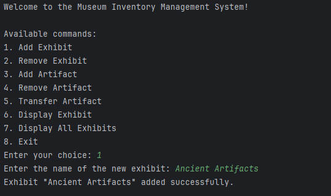
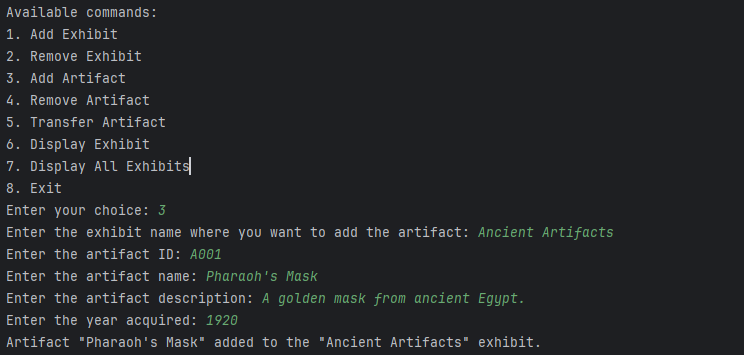
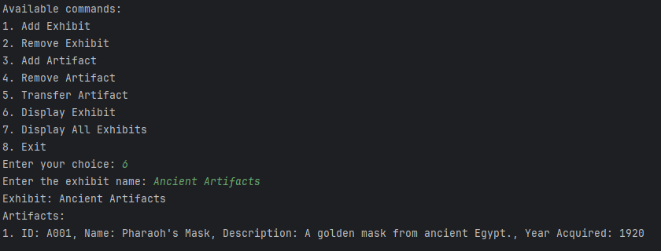

# Museum Inventory Management System

### Author: Rudy S

---

## Overview
The **Museum Inventory Management System** is a Java-based application designed to manage artifacts and exhibits within a museum. It features a command-line interface for performing tasks like:
- Adding and removing exhibits.
- Managing artifacts within exhibits.
- Transferring artifacts between exhibits.
- Displaying exhibit information.

---

## Features
- **Exhibit Management**: Organize your museum by adding or removing exhibits.
- **Artifact Management**: Add, update, or remove artifacts in exhibits.
- **Artifact Transfer**: Seamlessly transfer artifacts between exhibits.
- **User-Friendly CLI**: Simple interface for efficient management.

---

## Table of Contents
1. [Classes](#classes)
    - [Artifact](#1-artifact)
    - [Exhibit](#2-exhibit)
    - [Museum](#3-museum)
    - [Main](#4-main)
2. [Getting Started](#getting-started)
3. [Example Usage](#example-usage)
4. [Future Enhancements](#future-enhancements-)

---

## Classes

### 1. Artifact
| **Attribute**     | **Description**                    |
|--------------------|------------------------------------|
| `id`              | Unique identifier for the artifact |
| `name`            | Name of the artifact              |
| `description`     | Brief description of the artifact |
| `yearAcquired`    | Year the artifact was acquired    |

- **Methods**:
    - Getters and setters.
    - Constructor with input validation.
    - `toString()` for formatted representation.

---

### 2. Exhibit
| **Attribute**      | **Description**                    |
|---------------------|------------------------------------|
| `name`             | Name of the exhibit               |
| `artifacts`        | Set of artifacts within the exhibit |

- **Methods**:
    - Add or remove artifacts.
    - Retrieve artifacts.
    - `toString()` for exhibit details.

---

### 3. Museum
| **Attribute**      | **Description**                    |
|---------------------|------------------------------------|
| `exhibits`         | Map of exhibits by name            |

- **Methods**:
    - Add and remove exhibits.
    - Transfer artifacts between exhibits.
    - Display exhibits.

---

### 4. Main
The CLI provides interactive commands for managing the museum inventory.

---

## Getting Started

### Prerequisites
- Java 8 or higher
- A terminal or IDE (e.g., IntelliJ, Eclipse)
---
### Example Usage
1. Add an exhibit: "Ancient Artifacts"   
2. Add an artifact:  
   ID: A001   
   Name: Pharaoh's Mask   
   Description: A golden mask from ancient Egypt.  
   Year Acquired: 1920

## Sample images of output:

### Adding an exhibit
 

---

### Adding an artifact to an exhibit:

---

### Displaying artifacts

---

## Future Enhancements  
Implement data persistence for artifacts and exhibits.  
Develop a graphical user interface (GUI).  
Add user authentication for secure access.

